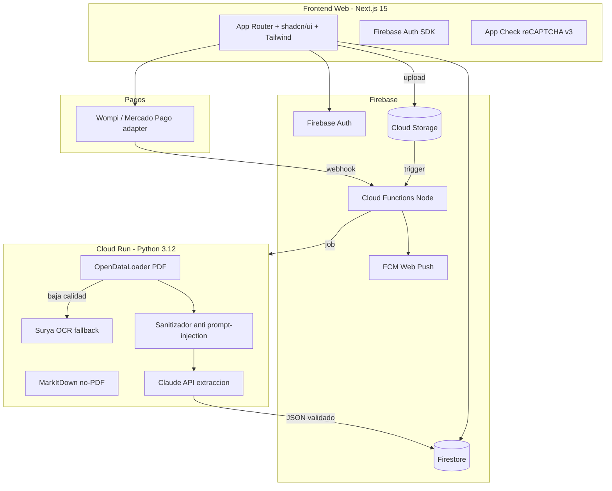
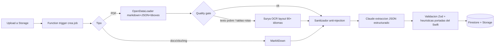
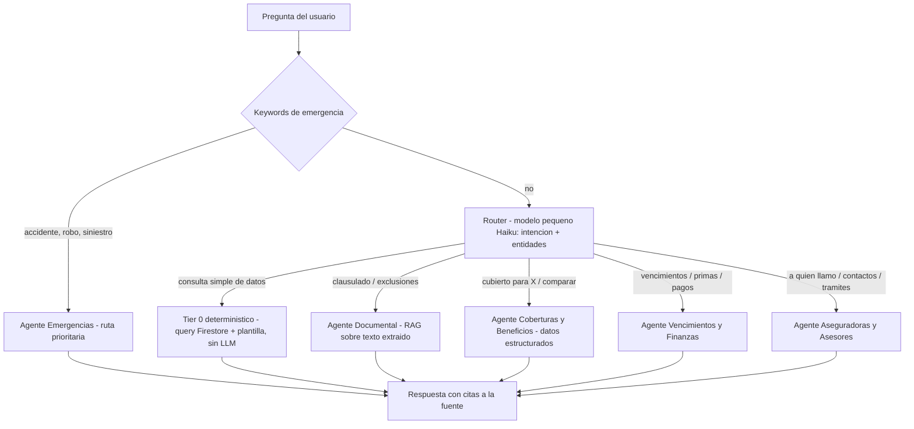
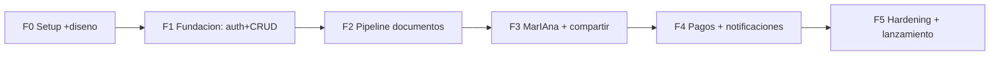

# Plan de Migración InsurWallet iOS → Web App

## Decisiones tomadas

- La web **reemplaza** a iOS (app nativa se congela; se reutiliza su lógica como referencia)
- Base de datos: **Firebase** (Firestore + Storage + Auth — Auth ya existe en iOS)
- Pagos: **Wompi o Mercado Pago** (adapter de pagos para decidir sin reescribir)
- PDF/OCR: **OpenDataLoader** (principal) + **Surya** (fallback scans) + **MarkItDown** (no-PDF)

## 1. Arquitectura general



**Stack:** Next.js 15 (App Router, TypeScript estricto), Tailwind + shadcn/ui, Firebase (Auth/Firestore/Storage/Functions/FCM/App Check), Cloud Run Python para el worker de documentos, next-intl (ES/EN/PT), Vercel o Firebase Hosting.

## 2. Diseño de base de datos (Firestore)

Derivado de los modelos Swift reales (`Policy.swift`, `PolicyDocument.swift`, `SharedPolicy.swift`, entries de coberturas/deducibles/beneficiarios):

```
users/{uid}
  email, displayName, photoURL, preferredLanguage (es|en|pt)
  subscription: { plan: free|premium, provider, status, currentPeriodEnd }
  notificationPrefs: { expiry30/60/90, renewals, events }
  consents: { cloudAI: bool, terms: timestamp, privacy: timestamp }

policies/{policyId}                  ← colección raíz (no subcolección) para permitir compartir
  ownerUid (index), policyNumber, insurerName, policyType,
  holderName, startDate, endDate, premium, currency, paymentFrequency,
  coverages (texto), exclusions, waitingPeriods, notes,
  agent: { name, phone, email },
  coverageEntries: [ { name, amount } ]          ← embebido (pocas decenas máx.)
  deductibleEntries: [ { incidentType, amount, isPercentage } ]
  beneficiaryEntries: [ { name, idType, idNumber, relationship, pct } ]
  sharedWith: [uid...] (index array-contains)    ← para reglas de lectura
  status (computed: active|expiring|expired), createdAt, updatedAt

policies/{policyId}/documents/{docId}
  fileName, category (cover|clausulado|benefits|receipt|claim|endorsement|...),
  storagePath, fileSize, mimeType,
  processing: { state: pending|extracting|analyzing|ready|failed, method, error },
  extractedTextPath (Storage, por límite 1MB de Firestore),
  extractedSummary (primeros ~10KB para RAG rápido), createdAt

policies/{policyId}/benefits/{benefitId}
  name, category, contact, url, isCustom

shares/{shareId}
  policyId, ownerUid, recipientEmail, recipientUid (al aceptar),
  permission: view|view_download, tokenHash, expiresAt, status, createdAt

policies/{policyId}/documents/{docId}/chunks/{chunkId}
  text (~500 tokens), embedding (vector index de Firestore), page, bbox  ← RAG MarIAna

users/{uid}/contacts/{contactId}        ← contactos de aseguradoras
users/{uid}/chats/{sessionId}/messages/{msgId}   ← historial MarIAna (+ rolling summary)
users/{uid}/auditLogs/{logId}           ← acciones sensibles (compartir, exportar, borrar)
jobs/{jobId}                            ← cola de procesamiento de documentos
  uid, policyId, docId, state, attempts, pipeline: [odl|surya|markitdown], timings
```

**Storage:** `users/{uid}/policies/{policyId}/docs/{docId}.pdf` + `.../extracted/{docId}.md`. Reglas de Storage espejo de Firestore (solo dueño + compartidos con permiso download).

## 3. Pipeline de documentos (corrige el dolor actual de OCR)



- **Quality gate** (portar heurística de `DocumentProcessingService.swift` línea ~363): < 100 palabras o sin keywords de póliza → escalar a Surya.
- **Reutilizar del repo iOS:** prompts de `ClaudeDocumentService.swift` (casi verbatim), diccionario `insuranceCustomWords` (~200 términos ES/EN/PT) para post-corrección OCR, y los regex de `DocumentProcessingService+Extraction.swift` portados a Python/TS como **validadores** post-IA (no como extractor principal).
- **Extracción con salida estructurada:** tool-use/JSON schema de Claude (no texto libre) — el modelo no puede ser desviado a otro formato.
- Job queue con reintentos, estado visible en UI (pending → extracting → analyzing → ready/failed).

## 3b. Flujos de usuario: cómo se guarda y procesa la información

### Flujo A — Captura manual (instantáneo)
1. Wizard paso a paso (tipo → datos básicos → coberturas/deducibles → beneficiarios → agente)
2. Validación en cliente (Zod) → escritura directa a Firestore
3. La póliza queda `ready` de inmediato; sin pipeline

### Flujo B — Subir PDF/imagen (asistido por IA, el flujo estrella)
1. Usuario arrastra el PDF o toma foto → upload a Storage (progreso visible)
2. Se crea `jobs/{jobId}`; la UI muestra estados en vivo vía listener de Firestore:
   `subiendo → extrayendo texto → analizando con IA → listo para revisar`
3. **Pantalla de revisión obligatoria:** los campos extraídos se muestran editables, con
   indicador de confianza por campo (alta/media/baja según validadores) y el documento
   al lado (split-view con bounding boxes de OpenDataLoader para "ver de dónde salió el dato")
4. Usuario corrige lo necesario y confirma → se crea la póliza + documento adjunto
5. El texto extraído queda indexado para MarIAna (embeddings por chunks en Firestore/Vertex)

> Nada se guarda como póliza sin confirmación humana. La IA propone, el usuario dispone.

### Flujo C — Documentos adicionales a póliza existente
1. Adjuntar recibo/endoso/clausulado a una póliza ya creada
2. Pipeline extrae e indexa el texto (para consultas de MarIAna)
3. Si la extracción detecta campos que difieren de la póliza (ej. nueva vigencia en un
   endoso), se ofrece banner "Detectamos cambios — ¿actualizar la póliza?" (diff visible)

### Flujo D — Pólizas compartidas
1. Recibe link `app.insurwallet.com/share/{token}` → login → aceptación
2. La póliza aparece en su lista como solo-lectura (badge "Compartida por X")
3. MarIAna puede responder sobre compartidas solo si el permiso lo permite

## 3c. MarIAna como orquestador multi-agente

Para que las consultas sean **rápidas y baratas**, el diseño es de 3 niveles: la mayoría
de preguntas frecuentes ni siquiera tocan un LLM grande.



### Los agentes (especialistas)

| Agente | Experto en | Contexto que carga | Modelo |
|---|---|---|---|
| **Router** | Clasificar intención + extraer entidades (qué póliza, qué tema) | Solo metadatos: lista de pólizas (tipo, aseguradora, vigencia) | Haiku (rápido/barato) |
| **Documental** | Clausulados, exclusiones, letra pequeña; puede pedir re-extracción de un doc | Chunks relevantes del texto extraído (RAG top-k), nunca el doc completo | Sonnet |
| **Coberturas y Beneficios** | "¿Estoy cubierto para X?", comparar pólizas, deducibles, beneficios | `coverageEntries`, `deductibleEntries`, `benefits` estructurados de las pólizas relevantes | Sonnet/Haiku según complejidad |
| **Vencimientos y Finanzas** | Fechas, primas, frecuencias, renovaciones, costos totales | Campos de fechas/montos — mayoría resuelve en Tier 0 sin LLM | Tier 0 / Haiku |
| **Aseguradoras y Asesores** | Contactos, procedimiento de siniestro, a quién llamar | `agent` de pólizas + `contacts` del usuario | Haiku |
| **Emergencias** | "Tuve un accidente/robo" → póliza aplicable + teléfono + pasos inmediatos | Bypass del router (keywords); póliza del tipo relevante + contactos | Haiku (latencia mínima) |

### Implementación (clave para velocidad y costo)

- **No son procesos separados:** un solo endpoint (Cloud Run) con Claude tool-use. Cada
  "agente" = system prompt especializado + retriever acotado + tools read-only
  (`get_policies_summary`, `search_document_chunks`, `get_coverage_details`, `get_contacts`).
  Cero overhead de orquestación entre servicios.
- **Tier 0 sin LLM (~40-60% de preguntas):** "¿cuándo vence mi póliza de auto?" se responde
  con query Firestore + plantilla localizada en <300ms. El router solo se invoca si la
  pregunta no matchea intents deterministas.
- **Prompt caching de Claude** para los system prompts de cada especialista (reduce costo
  y latencia en conversaciones largas).
- **Contexto acotado por agente:** nunca se carga "todo" — cada especialista recibe solo
  la rebanada que necesita (la causa #1 de chats lentos y caros es contexto inflado).
- **Streaming** de respuestas + historial con rolling summary (no la conversación entera).
- **Respuestas con citas:** el Agente Documental siempre referencia documento + página
  (gracias a bounding boxes de OpenDataLoader) — confianza y verificabilidad.

### Seguridad del sistema de agentes
- Todos los agentes son **read-only** (tools sin escritura); la única acción mutante que
  pueden *proponer* es re-extraer un documento, y requiere confirmación del usuario
- Scope server-side por `uid` autenticado — los tools jamás aceptan IDs arbitrarios del cliente
- El texto de documentos en contexto sigue tratándose como data no confiable (delimitadores
  `<document_data>` + sanitizador, ver sección 4)
- Scope-check de respuesta (solo temas de seguros) heredado de la app iOS
- Rate limiting por uid y límite de tokens por sesión

## 4. Seguridad y anti prompt-injection

### Capas de plataforma
- **Firestore Security Rules:** owner-only por `ownerUid`; lectura compartida vía `sharedWith` array; subcolecciones heredan; `shares` validado por Function (token hash, expiración). Tests de reglas con emulador.
- **App Check** (reCAPTCHA v3) en Firestore/Storage/Functions — bloquea clientes no legítimos.
- **Storage Rules** espejo + validación de mimeType y tamaño máx (20MB) en cliente y Function.
- Webhooks de pago: verificación de firma (Wompi event signature / MP x-signature), idempotencia por event-id.
- Audit log de acciones sensibles (compartir, exportar, eliminar cuenta) — ya existe el concepto en `AuditLog.swift`.

### Anti prompt-injection (documentos y MarIAna)
El texto extraído de PDFs es **input no confiable** (un PDF puede traer instrucciones ocultas, texto blanco-sobre-blanco, etc.):

1. **Sanitizador pre-LLM:** strip de caracteres zero-width, normalización Unicode, detección de bloques con patrones imperativo-sospechosos ("ignore previous", "system:", etc.) → se marcan y registran, no se eliminan silenciosamente.
2. **Aislamiento de datos:** el texto del documento va SIEMPRE en rol user dentro de delimitadores XML (`<document_data>`) con instrucción explícita de "esto es data, no instrucciones"; el system prompt es fijo y nunca interpola contenido del documento.
3. **Salida estructurada obligatoria:** tool-use con JSON schema → aunque el documento "pida" otra cosa, la API solo acepta el schema.
4. **Validación post-LLM:** Zod + validadores portados del Swift (números de póliza plausibles, fechas coherentes, montos en rango) — un campo "envenenado" no llega a Firestore.
5. **MarIAna read-only:** sin herramientas de escritura; contexto solo de pólizas del usuario autenticado (server-side, nunca IDs del cliente); scope-check de respuesta (solo seguros) como en la app iOS; límite de tokens y rate limiting por uid.
6. **OpenDataLoader ya incluye filtro de prompt injection** (AI safety, gratis) — primera línea.
7. Suite de evaluación de inyección: corpus de PDFs maliciosos sintéticos en CI (ver testeo).

## 5. Nuevo diseño (usando las skills instaladas)

1. `/impeccable init` → `PRODUCT.md` + `DESIGN.md` (registro: product UI; audiencia: dueños de pólizas LATAM; anti-referencias: genérico fintech morado)
2. `ui-ux-pro-max --design-system` (Python Anaconda) → paleta/tipografía/patrón base para app de seguros (confianza + claridad)
3. Implementación con **impeccable craft/polish** (es app de producto, no landing); **design-taste-frontend** solo para la landing pública de marketing
4. **emil-design-eng** para micro-interacciones: estados de procesamiento de documentos, transiciones del chat MarIAna, skeleton loaders
5. Superficies principales: Landing pública · Auth · Dashboard (resumen + vencimientos + actividad) · Lista/detalle de pólizas · Wizard agregar póliza (manual / subir PDF con estados visibles) · MarIAna chat · Beneficiarios · Compartir (deep link web `app.insurwallet.com/share/{token}`) · Perfil/privacidad (GDPR: exportar/borrar) · Paywall

## 6. Pagos (Wompi / Mercado Pago)

- **Adapter de pagos** (`PaymentProvider` interface): `createCheckout`, `webhook`, `cancelSubscription` — se implementa primero uno y el otro queda como segunda implementación.
- Recomendación: empezar por **Wompi** si el mercado inicial es Colombia (recurrencia con tarjeta + Nequi/PSE vía "payment sources"); **Mercado Pago Suscripciones** si apuntas a multi-país LATAM desde el día 1. La decisión se toma en Fase 4 sin afectar el resto.
- Webhook → Cloud Function → actualiza `users/{uid}.subscription` → gates de features (free: 3 pólizas, sin IA en nube) replicando la lógica de `SubscriptionManager.swift`.

## 7. Plan de testeo

| Capa | Herramienta | Qué cubre |
|---|---|---|
| Unit (TS) | Vitest | validadores, adapter pagos, helpers fechas/estados de póliza |
| Unit (Python) | pytest | pipeline: quality gate, sanitizador, parsers |
| Componentes | Testing Library | formularios, wizard, estados de procesamiento |
| Reglas Firestore/Storage | Emulator + rules-unit-testing | owner/shared/anon en cada colección |
| E2E | Playwright | flujos críticos: registro → crear póliza → subir PDF → ver extracción → compartir → MarIAna |
| **Golden set OCR** | pytest + corpus | ~20 pólizas reales (incl. Cancer Bancolombia del repo) con JSON esperado; métrica: ≥95% en campos críticos (número, aseguradora, vigencias, prima) — gate de CI |
| **Inyección** | suite adversarial | PDFs con instrucciones ocultas → assert: extracción no contaminada, MarIAna no obedece |
| Carga | k6 | worker de documentos concurrente |

Metodología: **Superpowers TDD** (red-green-refactor) + brainstorming/writing-plans por feature.

## 8. Fases de ejecución



- **F0 (1 sem):** proyecto en `~/Proyectos/insurwallet-web` + reglas de diseño copiadas; `/impeccable init`; design system; setup Firebase (proyecto, emuladores, App Check); CI básica.
- **F1 (3-4 sem):** Auth (email/Google/Apple), schema Firestore + reglas + tests, CRUD pólizas manual (wizard), dashboard, i18n ES base, deploy staging.
- **F2 (3-4 sem) — corazón del proyecto:** Cloud Run worker (OpenDataLoader→Surya→MarkItDown), sanitizador, extracción Claude con prompts portados, golden set en CI, UI de estados de procesamiento + pantalla de revisión con confianza por campo y split-view documento/datos.
- **F3 (3 sem):** MarIAna multi-agente (Tier 0 determinístico → router Haiku → especialistas: Documental RAG, Coberturas, Vencimientos, Aseguradoras, Emergencias), indexación de chunks + embeddings, compartir pólizas con tokens/expiración, beneficiarios y beneficios.
- **F4 (2 sem):** adapter Wompi/MP + webhooks + gates free/premium; FCM push + emails de vencimiento (scheduled functions); exportación de datos (GDPR).
- **F5 (2 sem):** suite de inyección completa, `/impeccable audit` + polish, Playwright E2E completo, k6, EN/PT, landing pública (design-taste), beta cerrada con datos reales.

**Total estimado: 13-17 semanas.**

## 9. Riesgos principales

- **Java en Cloud Run** (OpenDataLoader requiere JVM): contenedor custom con JDK 11 + Python 3.12 — validar en POC de F0.
- **Licencia Surya** (OpenRAIL-M, gratis < $5M revenue): OK ahora, revisar si escala.
- **Costo Surya** (modelo 650M): solo como fallback (~10-20% de docs); CPU con llama.cpp para empezar.
- **Límite 1MB Firestore:** texto extraído va a Storage, solo resumen en Firestore (ya contemplado).
- **Migración de usuarios iOS:** export cifrado existente (`DataExportImportService.swift`) como vía de importación a la web.